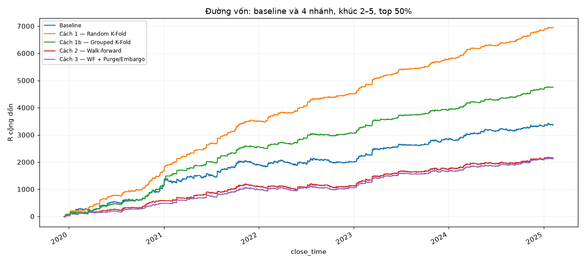
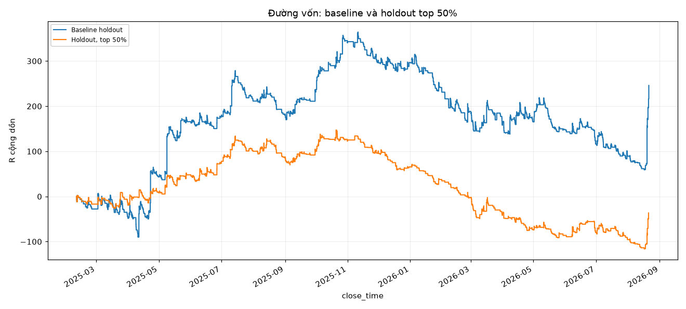

# BÁO CÁO KỸ THUẬT — PYRAMID BTCUSD / CATBOOST

Báo cáo mô tả quy trình ML đang có trong repo: tạo mẫu giao dịch, gán nhãn, xây dựng feature, chia dữ liệu, train, chấm điểm và backtest. Số liệu chính lấy từ `outputs/step4_thread1/` và `outputs/holdout/`. Kết quả notebook được ghi riêng khi khác phạm vi đánh giá. Các thống kê bổ sung ở mục 2, 7 và 12 được kiểm lại từ CSV/model đã lưu khi viết báo cáo; không có lần train mới trong đợt này.

## 1. Bài toán và phạm vi

Project nghiên cứu ảnh hưởng của cách chia train/test đến phép đánh giá bộ lọc tín hiệu BTCUSD. Một tín hiệu của `PyramidStrategy` tạo lệnh gốc và ba lệnh nhồi liên tiếp cùng `origin_bar`. Các mẫu gần nhau về giá, feature và cửa sổ nhãn; chia ngẫu nhiên từng dòng có thể đưa thành viên cùng họ sang hai phía train/test. [Đề cương](tom_tat_idea_goc.md) đặt trọng tâm vào độ tin cậy của đánh giá.

Đây là bài toán **phân loại nhị phân trên dữ liệu bảng có thứ tự thời gian**. Đầu vào CatBoost là 23 feature tại entry; đầu ra là xác suất `label=1` theo luật triple-barrier. Chiến lược gốc sinh tín hiệu mua, model xếp hạng tín hiệu để giữ top-k. Output cuối gồm bảng OOF, metric phân loại, danh sách lệnh được giữ, metric tài chính, đường vốn và manifest kiểm chứng.

Phạm vi đã triển khai: BTCUSD M15, nguồn giá M1, chiến lược long-only, bốn cách chia, một cấu hình CatBoost cố định, sweep giữ 20–80% lệnh và một giai đoạn holdout. Notebook bổ sung hai baseline ML; ứng dụng `be/`–`fe/` phục vụ demo. Trạng thái và giới hạn của hai phần này được đối chiếu ở mục 10, 13 và 14.

## 2. Dataset

Nguồn giá là [`BTCUSD_m1_2018_to_now.csv`](../data/raw/README.md), định dạng OHLCV M1 xuất kiểu MetaTrader: `Date, Time, Open, High, Low, Close, Volume`. [Stage 3](../outputs/holdout/stage3/stage3_report.json) ghi khoảng thời gian nguồn từ `2018-01-01 22:01:00` đến `2026-08-21 09:33:00`. File khoảng 209 MB không được commit; repo chưa có thông tin đủ để xác nhận nhà cung cấp và quy ước múi giờ của giá. Code parse timestamp không gắn timezone.

| Tập / artifact | Quy mô | Vai trò |
|---|---|---|
| [`dataset_catboost.csv`](../data/processed/dataset_catboost.csv) | 25.008 dòng × 31 cột; 6.252 họ × 4 leg | Train đóng băng; entry từ 04/01/2018 đến 06/02/2025 |
| [Dataset tái sinh toàn lịch sử](../outputs/holdout/stage1/dataset_catboost_full_regenerated.csv) | 30.040 dòng | Đối chiếu trước khi tách holdout |
| Bốn lệnh biên | Entry trước mốc holdout, nhãn chưa hoàn tất khi cắt nguồn ở mốc | Có trong bản tái sinh; không thêm vào train đóng băng hoặc tập đánh giá holdout |
| [`dataset_catboost_holdout.csv`](../outputs/holdout/stage1/dataset_catboost_holdout.csv) | 5.028 dòng × 31 cột | Đầu vào model cuối; entry thực tế từ 09/02/2025 đến 21/08/2026 |
| [`holdout_scored.csv`](../outputs/holdout/stage3/holdout_scored.csv) | 5.028 dòng × 32 cột | Dataset holdout thêm `probability` |

Mốc tách cố định là `2025-02-08 15:30:00`, bar M15 `199968`. Theo số lệnh, holdout chiếm `5028/30040 ≈ 16,74%`; không diễn giải ước lượng “20% cuối” trong đề cương thành tỷ lệ mẫu chính xác.

| Phân bố nhãn đã kiểm từ CSV | Nhãn 0 | Nhãn 1 | Tỷ lệ nhãn 1 |
|---|---:|---:|---:|
| Train đóng băng | 18.466 | 6.542 | 26,16% |
| Holdout | 3.618 | 1.410 | 28,04% |

Hai tập có 0 ô thiếu, 0 feature vô cực và 0 khóa trùng `(origin_bar, entry_bar, leg)` trong lần kiểm tra từ artifact. Đây là tính chất của dataset đã xử lý; không suy ra nguồn M1 ban đầu hoàn toàn sạch.

Schema gồm 23 `FEATURES` số, `label` nhị phân và 7 `META`: `entry_time, label_end_time, origin_bar, entry_bar, entry_price, leg, entry_vs_base_R`. Hai cột thời gian được parse thành datetime; bar/leg là chỉ số nguyên, giá và tỷ lệ là số thực. `row_id` được thêm sau stable sort để nối kết quả và phá hòa top-k, không phải feature.

## 3. Phân tích dữ liệu đã thực hiện

[Notebook trong `notebooks/`](../notebooks/Do_An_Meta_Labeling_BTCUSD.ipynb) có output của kiểm tra kích thước/NaN, biểu đồ phân bố lớp, ma trận tương quan Pearson và feature importance. [Bản notebook ở thư mục gốc](../Do_An_Meta_Labeling_BTCUSD.ipynb) có gần cùng code nhưng không lưu output. Khi dẫn cell trong báo cáo này, chỉ số cell bắt đầu từ 0 và thuộc bản trong `notebooks/`.

EDA trả lời ba câu hỏi:

- **Nhãn có mất cân bằng không?** Cell 3–4 kiểm dữ liệu và đếm nhãn; lớp 1 chiếm khoảng một phần tư mẫu. Điều này giải thích cấu hình class weight và việc báo cả F1 bên cạnh ROC-AUC.
- **Feature có dư thừa hoặc các leg có gần trùng nhau không?** Cell 5 vẽ tương quan Pearson trên 23 feature. [Báo cáo feature](bao_cao_feature.md) còn ghi phân tích Spearman và tương quan trong họ ở giai đoạn thiết kế. Code hiện tại dùng danh sách feature cố định; không chạy chọn feature tự động từ heatmap.
- **Model cuối sử dụng feature nào nhiều?** Cell 9 gọi `get_feature_importance()` trên model Stage 2. Đọc lại model cho năm giá trị cao nhất: `breakeven_R` 9,32%; `vol200` 8,84%; `dist_ema200_atr` 6,02%; `atr_ratio_14_90` 5,85%; `hour` 5,85%. Đây là importance toàn model, không phải lời giải thích nhân quả hoặc đóng góp riêng của một lệnh.

Không có bước phát hiện/loại outlier tự động trong pipeline train. Các phân tích tương quan, phân bố và importance phục vụ kiểm tra, diễn giải; chúng không biến thành một bước fit-transform trước mỗi fold.

## 4. Nạp dữ liệu, tạo ứng viên và gán nhãn

### 4.1. Thứ tự xử lý

[`prepare_data`](../src/citd_ml/labeling/triple_barrier.py) kiểm cột M1, parse thời gian và giá với `errors="raise"`, sort thời gian, cắt nguồn trước mốc được truyền rồi resample 15 phút. M15 lấy Open đầu, High lớn nhất, Low nhỏ nhất, Close cuối và tổng Volume; `dropna()` bỏ bar tổng hợp còn thiếu. Mảng `lo/hi` ánh xạ mỗi bar M15 về lát M1 để xét thứ tự chạm mốc.

Không có nội suy khoảng trống, imputation, clipping/winsorization hoặc tự xóa timestamp M1 trùng trong loader này. Các validator ở bước sau chặn dữ liệu không hợp lệ; không âm thầm sửa dataset để đủ số dòng.

[`PyramidStrategy`](../src/citd_ml/strategy/pyramid_strategy.py) dùng Momentum(14), VWAP(142), ATR(90), warm-up 200 bar. Tín hiệu xuất hiện khi Momentum giảm, VWAP tăng trên bar đã đóng và không còn lệnh gốc mở. Lệnh gốc vào ở Open hiện tại; ba leg nhồi được hẹn tại ba bar kế tiếp. Mỗi vị thế có stop ban đầu 0,6%, target giao dịch 33,7%, trailing cách đỉnh `3,8 × ATR` đóng băng trước entry; vị thế còn lại đóng vào thứ Sáu từ 20:40 theo timestamp nguồn.

### 4.2. Target học máy

CatBoost học xác suất lệnh đạt `label=1`: giá tới ngưỡng mà trailing stop có thể dời đến hòa vốn, theo luật gán nhãn dưới đây. Nhãn này là đại diện cho chất lượng tín hiệu; nó không đồng nhất với `R > 0` khi chiến lược đóng lệnh.

`upper = entry_price + 3,8 × ATR(90)`; `lower = entry_price × (1 − 0,006)`; horizon = 50 bar M15.

`label_one_entry` xét M1 lần lượt trong mỗi bar M15. Chạm lower, kể cả nến M1 chạm cả upper/lower, cho nhãn 0. Chạm upper chỉ cho nhãn 1 sau khi kiểm hết bar M15 đó và không thấy lower chạm. Hết 50 bar không có quyết định thì nhãn 0. Nếu nguồn kết thúc trước khi xác định được nhãn và chưa đủ horizon, dòng mang cờ incomplete và bị loại khi xuất dataset. Luật nhãn không dùng thoát lệnh thứ Sáu. [Sơ đồ sáu quy tắc](thong_so_triple_barrier.png) là tài liệu đối chiếu.

| File / hàm chính | Đầu vào → xử lý / kiểm tra | Đầu ra / artifact |
|---|---|---|
| `triple_barrier.prepare_data` | CSV M1, mốc cắt → kiểm cột/kiểu, resample và lập lát M1 | M1, M15 và các mảng trong bộ nhớ |
| `PyramidStrategy.prepare`, `entry_signal` | OHLCV và state → tính chỉ báo, kiểm warm-up và điều kiện vào | Mảng chỉ báo; giá trị có/không mở họ |
| `PyramidStrategy.open_bar` | Bar, chỉ báo → mở leg đến hạn, kiểm tín hiệu, hẹn leg và dời trailing | Cập nhật `positions/pending`; không trả DataFrame |
| `Position.trail`, `PyramidStrategy.scan_bar`, `friday_close` | Vị thế, M1/thời gian → dời stop, xử lý thoát lệnh | State mới; hai hàm thoát trả sự kiện đóng |
| `calculate_barriers` | Giá entry, ATR, tham số → tính ngưỡng cố định | Upper và lower |
| `label_one_entry` | Entry, hai ngưỡng, M1 → áp dụng sáu quy tắc | Nhãn, số bar, thời điểm chạm, cờ incomplete |
| `run_strategy_and_label` | Replay chiến lược, gán nhãn từng vị thế thực sự mở | Bảng nhãn thô, số lệnh đóng |
| `prepare_handoff_output` → `main` | Loại incomplete, ép schema, kiểm nhãn 0/1, sort | [`triple_barrier_labels.csv`](../data/processed/triple_barrier_labels.csv) |

Khi tái sinh toàn lịch sử, dữ liệu phía trước mốc tăng từ 25.008 lên 25.012 dòng vì bốn entry sát biên nay có đủ tương lai để gán nhãn. [Stage 1](../scripts/holdout_stage1_split.py) chỉ kiểm rằng 25.008 khóa cũ và 575.184 ô feature khớp, rồi ghi phần holdout. Giữ train đóng băng bảo toàn thứ tự dòng, fold và kết quả đã bàn giao.

## 5. Feature engineering

[`build_features.py`](../src/citd_ml/features/build_features.py) tính lại chỉ báo từ OHLCV tại entry của từng leg. Với entry bar `i`, feature thị trường đọc bar đã đóng `i−1`; `gap_open_atr` dùng thêm Open của `i`, đã biết khi vào lệnh. `hour/dow` lấy thời điểm entry. Điều kiện `entry_bar >= 1` ngăn chỉ số âm đọc nhầm cuối chuỗi.

| Nhóm | Feature | Thông tin cung cấp |
|---|---|---|
| Hàng rào | `breakeven_R` | Khoảng cách tới upper theo đơn vị stop-loss |
| Biến động | `atr14_pct, atr_ratio_14_90, vol20, vol200, vol_ratio_20_200, range_pct` | Mức biến động và tương quan ngắn/dài hạn |
| Xu hướng / vị trí giá | `dist_ema20_atr, dist_ema50_atr, dist_ema200_atr, ret20_atr, ret50_atr, pos_in_range50, dist_hh20_atr` | Khoảng cách tới EMA, đỉnh và vùng giá |
| Tín hiệu | `mom14, mom_diff, vwap_dist_atr, vwap_slope_atr, rsi14` | Động lượng và trạng thái quanh VWAP |
| Volume / entry | `vol_ratio_volume, gap_open_atr` | Volume tương đối và gap mở cửa |
| Thời điểm | `hour, dow` | Giờ và ngày trong tuần, giữ dạng numeric |

Ví dụ: `breakeven_R = 3,8 × ATR_frozen / (entry_price × 0,006)`; `dist_ema50_atr = (Close − EMA50) / ATR14`; `gap_open_atr = (Open[i] − Close[i−1]) / ATR14[i−1]`. Chia theo ATR hoặc giá chuyển các đại lượng về tỷ lệ tương đối, giảm phụ thuộc mức giá BTC. Đây là phép tạo feature theo công thức, không phải fit `StandardScaler`.

Bộ 23 feature được chọn thủ công theo nghiệp vụ và phân tích dư thừa được ghi trong [báo cáo feature](bao_cao_feature.md). Code loại giá tuyệt đối, `origin_bar` và các cột mô tả họ khỏi `X`; các cột biết sau giao dịch như `R, exit_reason, bars_to_label` cũng không được dùng. `leg/entry_vs_base_R` vẫn có trong metadata để truy vết. Pipeline không có PCA, chọn feature theo importance, one-hot, target encoding hay scaler học từ toàn dataset.

| Hàm trong `build_features.py` | Đầu vào → xử lý / kiểm tra | Đầu ra / artifact |
|---|---|---|
| `resolve_positions` | M15/M1 → replay đúng các entry; gọi chung barrier/label cho mọi leg | Bảng vị thế, nhãn, khóa lệnh |
| `build_features` | OHLCV và vị thế → tính chỉ báo, lấy giá trị tại entry đúng leg | Bảng feature và metadata trong bộ nhớ |
| `main` | Ghép nhãn, tạo `label_end_time`, bỏ incomplete, stable sort theo `entry_time, leg` | CSV theo `FEATURES + label + META`; mặc định [`dataset_catboost.csv`](../data/processed/dataset_catboost.csv) |
| [`verify_dataset.main`](../src/citd_ml/features/verify_dataset.py) | Dataset đóng băng → kiểm định dạng, 25.008 dòng, nhãn, NaN/Inf, khóa, thời gian và nối tradelist nếu có | Console PASS/FAIL, exit code 0/1; không sửa CSV |

`label_end_time` hiện lấy thời điểm chạm barrier; khi hết horizon lấy cuối bar thứ 50. Điểm khác giữa thời điểm chạm upper và thời điểm xác nhận nhãn 1 được ghi ở mục 15 để tránh khẳng định quá mức về purge.

## 6. Lựa chọn model

CatBoost là model chính được giữ cố định để so bốn cách chia. Nó nhận feature số và mô hình hóa quan hệ phi tuyến, tương tác giữa biến động, vị trí giá và hàng rào mà không cần tạo trước các tích chéo feature. Đây là giải thích kỹ thuật cho sự phù hợp với dữ liệu bảng; repo chưa có phép so sánh hợp lệ chứng minh CatBoost tốt nhất.

| Model | Vai trò và cấu hình có bằng chứng | Trạng thái |
|---|---|---|
| `CatBoostClassifier` | Model chính; cùng cấu hình ở 18 fold và model cuối | Có OOF, metric, hai model cuối `.cbm` và manifest |
| `LogisticRegression` | Baseline tuyến tính trong notebook cell 10; `max_iter=1000, class_weight="balanced", random_state=42` | Có output; có `ConvergenceWarning` |
| `RandomForestClassifier` | Baseline bagging trong cell 10; 100 cây, depth 6, class weight balanced, seed 42, `n_jobs=1` | Có output; dùng cùng phần train/test với Logistic Regression |

Notebook chỉ refit hai baseline trên phần đầu dataset, trong khi CatBoost được load từ model cuối đã fit toàn bộ train. Vì vậy bảng ba model có chồng lấn train/test ở dòng CatBoost; kết quả được lưu để truy vết ở mục 10.5, không dùng để xếp hạng model.

## 7. Thuật toán và objective

Đọc `get_all_params()` từ [model Stage 2 run 1](../outputs/holdout/stage2/catboost_final_holdout_run1.cbm) xác nhận `loss_function="Logloss"`, `boosting_type="Plain"`, `grow_policy="SymmetricTree"`, `task_type="CPU"`, `leaf_estimation_method="Newton"` và 1.000 cây. Đây là tham số thực của model đã lưu; `MODEL_PARAMS` chỉ khai báo tường minh một phần trong số đó. Không mô tả lần chạy này là Ordered Boosting chỉ vì model mang tên CatBoost.

CatBoost cộng dần đầu ra các cây để điều chỉnh điểm phân loại. Cây đối xứng dùng cùng phép tách ở các nút cùng tầng; depth 6 giới hạn tối đa 64 lá mỗi cây. Learning rate 0,05 giảm mức đóng góp của mỗi cây mới. `l2_leaf_reg=3` điều chuẩn giá trị lá để hạn chế fit quá sát dữ liệu.

Loss nhị phân có trọng số:

$$
L = -\frac{\sum_i w_i\,[y_i\log p_i + (1-y_i)\log(1-p_i)]}{\sum_i w_i}.
$$

`y_i` là nhãn 0/1, `p_i` là xác suất lớp 1, `w_i` là trọng số lớp. Model cuối lưu class weights xấp xỉ `[1; 2,8227]`, tương ứng tỷ lệ 18.466/6.542. Quy tắc `auto_class_weights="Balanced"` giống nhau giữa các fold; trọng số số học được suy từ từng tập train, không nhất thiết bằng nhau giữa các fold.

`eval_metric="AUC"` quy định metric đánh giá, không thay Logloss làm objective. Pipeline không có epoch/batch size kiểu mạng neural, không dùng Adam/SGD do project tự cấu hình. Hai baseline notebook lần lượt học biên tuyến tính và tổng hợp nhiều cây bagging; cấu hình của chúng ở mục 6.

## 8. Training process

### 8.1. Chuẩn bị và chia fold

[`prepare_dataset`](../src/citd_ml/training/pre_train.py) đọc dataset đóng băng, kiểm schema, parse datetime, stable sort `entry_time`, thêm `row_id` rồi tách `X/y/meta`. Nó chặn sai số dòng, feature không hữu hạn, nhãn sai, thời gian vượt mốc và họ không đủ leg 0–3. Không có tập validation riêng để chọn tham số hay early stopping.

Năm khúc được cắt theo chỉ số dòng với biên `[0, 5001, 10003, 15004, 20006, 25008]`. [`split_data.py`](../src/citd_ml/training/split_data.py) tạo fold như sau:

| Hàm / cách chia | Đầu vào → xử lý / điều kiện | Đầu ra và mục đích |
|---|---|---|
| `make_random_kfold` — Cách 1 | `X`; 5-fold, shuffle, seed 0 | Mỗi dòng test một lần; có thể tách cùng họ và đảo thời gian |
| `make_grouped_kfold` — Cách 1b | `X/y/meta`; `GroupKFold` 5-fold, shuffle, seed 0, group theo `origin_bar` | Giữ cùng họ ở một phía; chưa chặn train dùng tương lai |
| `make_walk_forward` — Cách 2 | Năm khúc → train các khúc trước, test khúc kế tiếp | Bốn fold expanding; chỉ có OOF khúc 2–5 |
| `make_purged_walk_forward` — Cách 3 | Giữ train khi `label_end_time < test_start_time` và `entry_bar < test_start_bar − 50` | Bỏ nhãn tràn biên và vùng entry sát biên; giữ nguyên test |
| `validate_all_folds` | Kiểm chỉ số, train/test rời nhau, coverage, group và điều kiện từng phép chia | Dừng trước train nếu vi phạm; chưa ghi model/output |

| Fold theo thời gian | Train WF | Train sau purge/embargo | Test | Dòng train bị loại |
|---|---:|---:|---:|---:|
| Khúc 1 → 2 | 5.001 | 4.980 | 5.002 | 21 |
| Khúc 1–2 → 3 | 10.003 | 10.000 | 5.001 | 3 |
| Khúc 1–3 → 4 | 15.004 | 14.996 | 5.002 | 8 |
| Khúc 1–4 → 5 | 20.006 | 20.004 | 5.002 | 2 |

Nguồn: [`metrics_by_fold.csv`](../outputs/step4_thread1/catboost_training/metrics_by_fold.csv). K-Fold dùng xấp xỉ 80% dữ liệu mỗi lượt; Walk-forward dùng train tăng dần. Không có một tỷ lệ train/validation/test cố định áp dụng cho cả bốn nhánh.

Walk-forward cắt theo dòng đã sắp thời gian, không gom toàn bộ timestamp vào cùng khúc. Tại biên 15.004, dòng cuối train và đầu test cùng `entry_time=2022-07-05 08:45:00`; vì vậy không diễn giải nhánh này là bảo đảm mọi thời điểm train đều nhỏ hơn test. Nhánh Purged bổ sung hai điều kiện biên trong bảng trên.

### 8.2. Fit và lưu kết quả

| Tham số khai báo trong [`MODEL_PARAMS`](../src/citd_ml/training/train_catboost.py) | Giá trị | Vai trò |
|---|---|---|
| `iterations` | 1000 | Giữ số vòng boosting giống nhau giữa các fold |
| `learning_rate` | 0,05 | Điều chỉnh bước cập nhật mỗi cây |
| `depth` | 6 | Giới hạn độ phức tạp cây |
| `l2_leaf_reg` | 3,0 | Điều chuẩn giá trị lá |
| `auto_class_weights` | `Balanced` | Tăng trọng số lớp ít mẫu |
| `eval_metric` | `AUC` | Metric đánh giá; objective thực là Logloss |
| `random_seed` | 42 | Cố định nguồn ngẫu nhiên của model |
| `thread_count` | 1 | Ghim cấu hình thực thi của khối kết quả chính |
| `allow_writing_files` | `False` | Không tạo log/snapshot CatBoost ngầm trong thư mục làm việc |

Không truyền `cat_features`, `eval_set` hoặc early stopping vào `fit`. Giữ số vòng cố định giúp tránh một phép chia được train số cây khác chỉ vì điều kiện dừng khác. `hour/dow` giữ numeric. Code không có GridSearch/RandomizedSearch hay tuning riêng từng nhánh.

| Hàm trong `train_catboost.py` | Đầu vào → xử lý / kiểm tra | Đầu ra / artifact |
|---|---|---|
| `make_model` | `MODEL_PARAMS` → khởi tạo model mới | `CatBoostClassifier` chưa fit |
| `train_method` | `X/y/meta` và fold → kiểm đủ hai lớp, fit train, `predict_proba(X_test)[:,1]` | Metric từng fold, OOF; chặn xác suất ngoài [0,1] hoặc test chấm trùng |
| `_validate_oof_coverage` | Probability/fold → kiểm phủ toàn bộ K-Fold hoặc chỉ khúc 2–5 của WF | PASS/lỗi; NaN khúc 1 của WF là có chủ đích |
| `build_summary` | 18 dòng metric → kiểm 5/5/4/4 fold, lấy trung bình | Bảng tổng hợp trong bộ nhớ |
| `save_outputs` | Metric và bốn OOF → serialize | Sáu CSV: hai bảng metric và bốn `oof_<method>.csv` |
| `main` | `prepare_dataset → make_all_folds → validate_all_folds → train_method → save_outputs` | Điều phối một lượt train bốn nhánh |

Model từng fold không được lưu thành checkpoint trong pipeline này; OOF và metric là artifact bàn giao. Model cuối train trên 25.008 dòng được lưu thành hai `catboost_final_holdout_run*.cbm` để kiểm lặp.

[Manifest train](../outputs/holdout/stage2/train_run1_report.json) ghi Linux, Python 3.12.14, CatBoost 1.2.10, scikit-learn 1.9.0, pandas 3.0.5, NumPy 2.5.2, Plotly 7.0.0, Matplotlib 3.11.2. Thí nghiệm số luồng ghi 24 logical CPU; không có bằng chứng đủ về CPU model, RAM hoặc GPU. `catboost_info/` có log Logloss cục bộ nhưng thiếu liên kết run/fold với các artifact chính, nên không dùng nó để kết luận train–validation gap.

## 9. Phương pháp đánh giá và backtest

### 9.1. Metric phân loại

ROC-AUC đánh giá thứ hạng xác suất của hai lớp trên toàn bộ ngưỡng: 0,5 tương ứng mức phân biệt ngẫu nhiên; giá trị cao hơn cho biết xếp lớp 1 lên trên lớp 0 tốt hơn. Metric phù hợp với việc dùng model để xếp hạng, nhưng không phản ánh mức lãi/lỗ của từng lệnh.

F1 được tính sau khi phân lớp bằng `p >= 0,5`:

$$
F1 = \frac{2TP}{2TP+FP+FN}.
$$

`TP` là nhãn 1 dự đoán đúng; `FP` là nhãn 0 bị dự đoán thành 1; `FN` là nhãn 1 bị bỏ sót. F1 phản ánh cả precision và recall của lớp ít mẫu. Chọn ngưỡng 0,5 là quy tắc báo cáo cố định; project chưa thực hiện calibration hay tìm ngưỡng tối ưu trên validation.

[`train_method`](../src/citd_ml/training/train_catboost.py) tính metric trên test từng fold; [`chunk1_removed_metrics`](../scripts/holdout_stage4_report.py) lọc chung `row_id >= 5001` rồi tính lại theo từng fold và lấy mean. Vì vậy [`metrics_chunk2_5.csv`](../outputs/step4_thread1/catboost_training/metrics_chunk2_5.csv) là bảng so sánh bốn nhánh. [`metrics_summary.csv`](../outputs/step4_thread1/catboost_training/metrics_summary.csv) giữ toàn bộ fold; Random/Grouped trong đó khác phạm vi. AUC tính gộp tất cả OOF cũng không bằng mean AUC từng fold nói chung.

Holdout đo riêng trên 5.028 mẫu bằng model cuối. Accuracy, precision, recall và confusion matrix có code trong notebook; chúng không phải output chính của script train bốn nhánh. Mục 12 ghi số kiểm lại từ xác suất holdout.

### 9.2. Từ xác suất đến danh sách lệnh

Phân lớp ở ngưỡng 0,5 và giữ top 50% là hai phép khác nhau. Backtest sort `probability` giảm, phá hòa bằng `row_id` tăng và giữ `ceil(n × keep_pct/100)`. Trên khúc 2–5, top 50% giữ 10.004/20.007 lệnh; trên holdout giữ 2.514/5.028 lệnh.

Bước 4 dùng `shadow` để duy trì chuỗi tín hiệu baseline và `executor` để quản lý các lệnh được nhận khi mở. Stage 3 holdout replay baseline trên toàn lịch sử rồi chọn từ danh sách lệnh cố định. Cả hai đo chất lượng lọc trên cùng tập ứng viên. Top-k được xếp hạng offline trên toàn giai đoạn; repo chưa dựng ngưỡng có thể biết tuần tự ở mỗi thời điểm live.

| Hàm trong [`backtest_pyramid_local.py`](../src/citd_ml/backtest/backtest_pyramid_local.py) | Đầu vào → xử lý / kiểm tra | Đầu ra / artifact |
|---|---|---|
| `load` → `backtest` | M1 trước holdout → M15/lát M1, replay chiến lược | Tradelist trong bộ nhớ; `baseline_tradelist.csv` qua `save_outputs` |
| `validate_against_reference` | Replay và tradelist bàn giao → đối chiếu khóa, giá, thời gian | Dừng khi baseline lệch |
| `load_score_tables` | Bốn OOF → kiểm 25.008 row_id, fold, nhãn, metadata và vùng NaN cho phép | Bốn bảng điểm đã kiểm |
| `build_scored_universe` | OOF + tradelist → join one-to-one theo `(origin_bar, entry_bar, leg)`, đối chiếu entry | `backtest_scored_universe.csv` qua `save_outputs` |
| `select_top_percent` | Tập đánh giá, điểm, tỷ lệ → stable sort và ceil số lệnh | Danh sách chọn trong bộ nhớ |
| `backtest_filtered` | Thị trường, OOF, row_id giữ → shadow/executor; kiểm ứng viên và lệnh thực thi | Tradelist lọc; `trades_top50_<method>.csv` ở mức 50% |
| `calculate_metrics` → `build_reports` → `save_outputs` | Lệnh đã đóng → kiểm số lệnh, tính metric và lưu | `backtest_summary_top50.csv`, `backtest_retention_sweep.csv`; tổng tám CSV backtest |

### 9.3. Metric tài chính

`R = pl_pct / 0,6`, với `pl_pct` tính bằng điểm phần trăm. Net R là tổng R. MaxDD lấy mức giảm lớn nhất từ đỉnh của equity cộng dồn **từng lệnh đã đóng**, sort theo `close_time, ticket`, bắt đầu 0R. Profit factor là tổng R dương chia trị tuyệt đối tổng R âm; win rate là tỷ lệ `R > 0`. Code không tính phí, spread, slippage hoặc drawdown mark-to-market.

Riêng [`equity_by_close_time`](../scripts/holdout_stage4_report.py) gộp các lệnh đóng cùng lúc thành một điểm rồi vẽ bậc thang. Do đó đường vẽ và chuỗi từng giao dịch dùng tính MaxDD có độ phân giải khác nhau.

## 10. Các thí nghiệm và trạng thái bằng chứng

### 10.1. Bốn cách chia trên cùng CatBoost

**Mục tiêu:** đo sự thay đổi của kết quả đánh giá khi thay luật chia. **Cấu hình:** 23 feature, model mục 8, cùng dataset và top-k. **Thay đổi:** Random → Grouped → Walk-forward → Purged Walk-forward.

**Kết quả:** AUC trên khúc 2–5 lần lượt 0,8582 / 0,7454 / 0,5875 / 0,5895; bảng đầy đủ ở mục 11. Purge/embargo loại 21/3/8/2 dòng train ở bốn biên.

**Diễn giải kỹ thuật:** điểm đánh giá nhạy với cấu trúc split. Giữ họ và thứ tự thời gian đi kèm mức AUC thấp hơn Random. Thiết kế đồng thời thay đổi quan hệ giữa mẫu và lượng dữ liệu train; không thể quy toàn bộ chênh lệch cho một nguyên nhân leakage. Việc purge chỉ tác động ít dòng phù hợp với chênh lệch nhỏ giữa hai nhánh thời gian, nhưng chưa chứng minh purge không cần thiết ở bài toán khác.

### 10.2. Sweep tỷ lệ giữ lệnh

**Mục tiêu:** đo kết quả tài chính khi thay số tín hiệu được nhận. **Cấu hình:** giữ nguyên OOF/model, baseline và luật top-k. **Thay đổi:** tỷ lệ giữ 20/30/40/50/60/70/80%; không train lại.

**Kết quả:** [sweep bốn nhánh](../outputs/holdout/stage4/table3_branch_sweep_20_80.csv) có 28 tổ hợp. [Sweep holdout](../outputs/holdout/stage4/holdout_sweep_20_80.csv) cho net R lần lượt −30,01 / −50,01 / −53,17 / −36,55 / +73,16 / +186,92 / +259,91.

**Diễn giải kỹ thuật:** model không cải thiện net R holdout ở mức 50% đã chốt. Top 80% cao hơn baseline +245,93 R trong dữ liệu đã xem là quan sát độ nhạy; chưa phải chính sách mới được kiểm định ngoài mẫu.

### 10.3. Model cuối, holdout và chạy lặp

**Mục tiêu:** đối chiếu với giai đoạn sau mốc và kiểm khả năng chạy lại. **Cấu hình:** model cuối fit toàn bộ train đóng băng; purge/embargo tại biên đều loại 0 dòng. **Thay đổi:** chuyển từ model từng fold sang model cuối, rồi lặp độc lập để kiểm triển khai.

**Kết quả:** holdout AUC 0,6046, F1 0,4022; top 50% đạt −36,55 R. [Stage 2](../outputs/holdout/stage2/stage2_reproducibility_report.json) ghi 25.008 dự đoán train trùng từng phần tử và hash `.npy` bằng nhau. Hai `.cbm` có hash khác; metadata tuần tự hóa có thể khác nên hash binary chỉ được ghi nhận. [Stage 5](../outputs/holdout/repro/stage5_repro_report.json) PASS khi so xác suất holdout, top-k, bảng và bốn file HTML/PNG giữa hai lượt.

**Diễn giải kỹ thuật:** bằng chứng xác nhận repeatability trong môi trường đã ghi; nó không chứng minh model sinh lợi hay hai máy bất kỳ phải ra cùng byte.

### 10.4. Độ nhạy theo số luồng

**Mục tiêu:** tách ảnh hưởng của số luồng train khỏi việc chạy lặp và inference. [`thread_count_sensitivity.py`](../scripts/thread_count_sensitivity.py) giữ dữ liệu, feature, seed 42 và hyperparameter; chỉ thay `thread_count`. Kết quả trong [báo cáo thí nghiệm](../outputs/thread_count_sensitivity/README.md):

| Cấu hình | Holdout AUC | F1 | Top 50% net R | Số lệnh top 50% trùng với tc=1 |
|---|---:|---:|---:|---:|
| tc=1, lượt A | 0,6046 | 0,4022 | −36,5528 | 2.514/2.514 |
| tc=1, lượt B | 0,6046 | 0,4022 | −36,5528 | 2.514/2.514 |
| tc=2 | 0,6042 | 0,4069 | −12,2605 | 2.252/2.514 |
| tc=−1, mặc định | 0,6023 | 0,4065 | +30,7859 | 2.254/2.514 |

**Diễn giải kỹ thuật:** trên máy thí nghiệm, thay cấu hình train làm đổi prediction/top-k; lặp lại cùng cấu hình cho prediction bằng nhau. Đổi số luồng inference trên cùng model không đổi prediction. Phạm vi bằng chứng là một máy/build/dataset/seed; các khác biệt liên máy được ghi trong [sổ lịch sử](../outputs/verification/holdout_run_history.md), không được quy hết cho số luồng.

### 10.5. Baseline trong notebook và thí nghiệm thiết kế cũ

**Mục tiêu:** bổ sung đối chứng Logistic Regression và Random Forest. **Cấu hình:** cell 10 train hai baseline trên `4 × (25008 // 5) = 20.004` dòng, test 5.004 dòng còn lại; không scaling Logistic Regression. **Thay đổi so với pipeline:** biên notebook là 20.004, khác biên cuối WF chuẩn 20.006; CatBoost load model đã train trên toàn bộ 25.008 dòng.

| Output cell 10 đã lưu | Accuracy | Precision | Recall | F1 | ROC-AUC |
|---|---:|---:|---:|---:|---:|
| Logistic Regression | 45,28% | 28,53% | 79,33% | 0,4197 | 0,6053 |
| Random Forest | 56,65% | 31,70% | 63,94% | 0,4239 | 0,6261 |
| CatBoost — test nằm trong tập đã fit | 88,45% | 70,08% | 93,67% | 0,8018 | 0,9673 |

**Diễn giải kỹ thuật:** đây là số thật của output notebook, nhưng dòng CatBoost là đánh giá trên mẫu đã thấy; bảng không chứng minh CatBoost vượt hai baseline ngoài mẫu. Logistic Regression còn có cảnh báo không hội tụ sau 1.000 iteration. Hai điểm này chưa được sửa trong notebook hiện hành.

[Báo cáo hyperparameter](bao_cao_hyperparameter_triple_barrier.md) ghi sweep horizon và phân tích near-duplicate để chọn H=50, k=3; [báo cáo feature](bao_cao_feature.md) ghi bỏ cột dư thừa, đối chứng HistGradientBoosting và thử seed. Các ghi chép này giải thích lịch sử thiết kế. Repo hiện không cung cấp đủ script/output gốc để tái lập đầy đủ mọi thử nghiệm đó, nên không gộp các con số ấy vào khối kết quả chính.

## 11. Kết quả chính

Bốn nhánh dưới là mean theo fold trên 20.007 mẫu khúc 2–5; holdout là phép đo riêng trên 5.028 mẫu. Nguồn: [`table1_classification_metrics.csv`](../outputs/holdout/stage4/table1_classification_metrics.csv), khối `canonical_thread_count_1`.

| Phạm vi | ROC-AUC | F1 @ 0,5 |
|---|---:|---:|
| Random K-Fold | 0,8582 | 0,6494 |
| Grouped K-Fold | 0,7454 | 0,5077 |
| Walk-forward | 0,5875 | 0,3288 |
| Purged Walk-forward | 0,5895 | 0,3247 |
| Holdout | 0,6046 | 0,4022 |

Nguồn tài chính: [`table2_financial_metrics_top50.csv`](../outputs/holdout/stage4/table2_financial_metrics_top50.csv). So bộ lọc với baseline cùng giai đoạn; hai khối có số lệnh và thời kỳ khác nhau.

| Phạm vi / bộ lọc | Lệnh | Net R | MaxDD R | PF | Win rate |
|---|---:|---:|---:|---:|---:|
| Baseline khúc 2–5 | 20.007 | +3.358,25 | 236,13 | 1,2940 | 31,71% |
| Random top 50% | 10.004 | +6.937,53 | 73,76 | 2,5437 | 44,65% |
| Grouped top 50% | 10.004 | +4.752,04 | 99,71 | 1,9500 | 39,26% |
| Walk-forward top 50% | 10.004 | +2.148,31 | 211,29 | 1,4117 | 34,76% |
| Purged top 50% | 10.004 | +2.119,48 | 142,36 | 1,4074 | 34,99% |
| Baseline holdout | 5.028 | +245,93 | 305,32 | 1,0992 | 35,28% |
| Holdout top 50% | 2.514 | −36,55 | 263,25 | 0,9718 | 34,81% |



*Hình 1. Equity cộng dồn từ 0R trên khúc 2–5; [HTML tương tác](../outputs/holdout/stage4/equity-curve-chunk2-5-top50.html).*

Random và Grouped kết thúc cao hơn baseline; hai nhánh theo thời gian nằm gần nhau và thấp hơn baseline. Hình cho thấy kết quả lọc thay đổi theo thiết kế split trên cùng giai đoạn; không xác nhận đường vốn Random có thể đạt được khi giao dịch tuần tự.



*Hình 2. Equity holdout bắt đầu lại từ 0R; [HTML tương tác](../outputs/holdout/stage4/equity-curve-holdout-top50.html).*

Top 50% từng có equity dương nhưng giảm xuống âm về cuối kỳ, kết thúc kém baseline 282,48 R. AUC lớn hơn 0,5 phản ánh khả năng xếp hạng nhãn; kết quả tài chính còn phụ thuộc R của những lệnh giữ/bỏ.

## 12. Phân tích lỗi dự đoán

Tính lại từ [`holdout_scored.csv`](../outputs/holdout/stage3/holdout_scored.csv), trên toàn bộ 5.028 mẫu với `probability >= 0,5`:

| Nhãn thực / dự đoán | Dự đoán 0 | Dự đoán 1 |
|---|---:|---:|
| Nhãn 0 | TN = 2.422 | FP = 1.196 |
| Nhãn 1 | FN = 754 | TP = 656 |

Accuracy = 61,22%; precision lớp 1 = 35,42%; recall = 46,52%; F1 = 0,4022. Đây là phép kiểm bổ sung từ prediction đã lưu, không phải một lần train hoặc chọn ngưỡng mới. Có thể tái tính bằng đoạn sau từ repo root:

```python
import pandas as pd
from sklearn.metrics import confusion_matrix

d = pd.read_csv("outputs/holdout/stage3/holdout_scored.csv")
prediction = (d["probability"] >= 0.5).astype(int)
print(confusion_matrix(d["label"], prediction))
```

Model bắt được 656/1.410 mẫu nhãn 1; trong 1.852 mẫu dự đoán 1 có 1.196 mẫu nhãn 0. Mất cân bằng làm accuracy dễ gây hiểu sai: dự đoán tất cả là 0 đạt 71,96% accuracy trên chính holdout nhưng recall/F1 lớp 1 bằng 0.

FP/FN ở đây là sai theo **nhãn triple-barrier**, không trực tiếp bằng “mất tiền/bỏ lỡ lợi nhuận”. Quy tắc backtest top 50% giữ 2.514 lệnh, khác 1.852 mẫu vượt ngưỡng 0,5. Vì vậy không dùng confusion matrix này làm bảng lãi/lỗ của top 50%.

Cell 17 trong notebook có ảnh confusion matrix nhưng cũng lưu thông báo kernel crashed; output đó không chứng minh notebook chạy sạch từ đầu đến cuối. Repo chưa có phân tích lỗi đã kiểm chứng theo năm, chế độ biến động hoặc từng họ lệnh; nguyên nhân FP/FN cụ thể còn thiếu bằng chứng.

## 13. Vấn đề kỹ thuật và cách xử lý

| Vấn đề / nguyên nhân có bằng chứng | Cách code xử lý hoặc trạng thái hiện tại | Ảnh hưởng |
|---|---|---|
| Sinh đủ tương lai làm xuất hiện thêm bốn lệnh biên | Stage 1 đối chiếu khóa/feature và giữ train đóng băng | Không làm dịch fold đã chốt |
| Dòng trùng thời gian có thể đổi thứ tự; join bằng vị trí dễ ghép nhầm lệnh | Stable sort, `row_id` và join one-to-one bằng khóa giao dịch | Giữ cùng mẫu xuyên dataset → OOF → backtest |
| WF không có model trước khúc 1 | OOF khúc 1 để NaN/fold −1; validator kiểm đúng coverage | Không giả tạo prediction; so chung khúc 2–5 |
| Bỏ lệnh gốc có thể đổi state và tạo tín hiệu ngoài bảng OOF | `backtest_filtered` tách shadow/executor, kiểm ứng viên và tập lệnh nhận | Giữ thiết kế tập ứng viên cố định |
| Chạy cùng seed nhưng đổi số luồng train làm đổi kết quả | Ghim `thread_count=1`; lưu thí nghiệm và manifest môi trường | Tách đổi cấu hình khỏi lỗi chạy lặp |
| Hai model `.cbm` khác hash | Stage 2 kiểm mảng prediction/hash `.npy` và hash input; vẫn ghi hash model | Không nhầm metadata serialization với prediction lệch |
| Logistic Regression báo chưa hội tụ; notebook có kernel crash | Output lưu cảnh báo/log lỗi; chưa có sửa và rerun sạch được chứng minh | Bảng baseline và trạng thái notebook phải ghi giới hạn |

Ba khác biệt ảnh hưởng cách dùng kết quả cần giữ rõ:

1. **So ba model và ROC trong notebook:** cell 10 dùng CatBoost đã fit cả phần test. Cell 13 và [script sinh hình](../scripts/generate_all_visual_figures.py) lọc `fold >= 1` nhưng chú thích là “khúc 2–5”; điều này vẫn giữ khúc 1 của Random/Grouped. Chúng còn tính pooled AUC, khác mean theo fold ở bảng chính. Report dùng `chunk1_removed_metrics` và artifact canonical làm mốc.
2. **Nhãn và tiền lời:** một số chú thích notebook/hình gọi nhãn 1 là “Thắng” và FP là “Mất tiền”. Code label và code tính R là hai luồng khác nhau; cách đọc chính xác ở mục 4 và 12.
3. **Demo và thực nghiệm:** [`DataService.get_splits_comparison`](../be/app/services/data_service.py) hard-code F1/net R và dựng ROC bằng hàm lũy thừa. `get_sample_candles_and_signals` sinh OHLC ngẫu nhiên quanh giá entry, dùng ATR/horizon minh họa. Các giá trị đó không được đưa vào bảng thực nghiệm của báo cáo.

Các khác biệt trên được ghi nhận từ implementation hiện tại; đợt biên soạn này không thay code hoặc tạo lại kết quả huấn luyện.

## 14. Pipeline cuối cùng và cách chạy

### 14.1. Tổ chức và luồng thực thi

[`paths.py`](../src/citd_ml/paths.py) xác định đường dẫn từ repo root và giữ mốc holdout, embargo, horizon. [`pyproject.toml`](../pyproject.toml) khai báo package và phiên bản phụ thuộc. `src/citd_ml/` chứa xử lý ML; `scripts/` chứa entrypoint và điều phối holdout; `data/processed/` là input đóng băng; `outputs/` lưu evidence. Notebook đọc các artifact và thêm phân tích; EDA không phải bước tự động bắt buộc trong script train.

Luồng tính toán:

```text
M1 → prepare_data → M15 + lát M1
   → replay PyramidStrategy → nhãn từng leg + feature tại entry
   → dataset đóng băng → prepare_dataset → bốn bộ fold
   → CatBoost từng fold → OOF → join baseline → top-k → metric/backtest
   → model cuối trên train → xác suất holdout → baseline holdout → top-k
   → bảng, equity → đối chiếu hai lượt → manifest
```

| Script | Đầu vào → hàm gọi / kiểm tra chính | Artifact |
|---|---|---|
| [`build_dataset.py`](../scripts/build_dataset.py) | M1, `--holdout` → `features.build_features.main` | Dataset theo `--output` |
| [`verify_dataset.py`](../scripts/verify_dataset.py) | Dataset mặc định → `features.verify_dataset.main` | Console/exit code; không ghi file |
| [`train_models.py`](../scripts/train_models.py) | Dataset đóng băng → `training.train_catboost.main` | Sáu CSV train trong `--output-dir` |
| [`run_backtest.py`](../scripts/run_backtest.py) | M1, OOF từ `--oof-dir` → `backtest_pyramid_local.main` | Tám CSV trong `--output-dir` |
| [`verify_pipeline.py`](../scripts/verify_pipeline.py) | CSV đã lưu → `check_repeated_runs` qua `main`; hai lượt trong bộ nhớ | JSON theo `--manifest`; CSV không bị ghi đè |

| Holdout / hàm điều phối | Đầu vào → xử lý / điều kiện dừng | Artifact |
|---|---|---|
| [Stage 1](../scripts/holdout_stage1_split.py) · `main` | Bản tái sinh + train cũ → so 25.008 khóa/575.184 ô feature; fail thì không ghi holdout | `stage1_validation_report.json`, `dataset_catboost_holdout.csv` |
| [Stage 2](../scripts/holdout_stage2_train.py) · `precheck, run_training, verify` | Purge/embargo tại mốc; khác 0 thì dừng; fit hai model cùng cấu hình, so prediction | Hai `.cbm`, hai `.npy`, `train_run*_report.json`, `stage2_reproducibility_report.json` |
| [Stage 3](../scripts/holdout_stage3_backtest.py) · `load_market, replay_baseline, validate_holdout_baseline, main` | Model + holdout + M1 → replay toàn lịch sử giữ state; so 5.028 lệnh, giá/R với `atol=5e-4`; join one-to-one | `holdout_scored.csv`, vũ trụ có điểm, bảy danh sách top-k, summary và report |
| [Stage 4](../scripts/holdout_stage4_report.py) · `chunk1_removed_metrics, build_table1..4, equity_by_close_time, write_chart, write_png` | OOF/Stage 3 + evidence → kiểm nguồn rồi lập bảng/hình | Bốn bảng CSV, hai equity ở HTML/PNG, manifest và [báo cáo holdout](BAO_CAO_KET_QUA_HOLDOUT.md) |
| [Stage 5](../scripts/holdout_stage5_repro_check.py) · `compare_probabilities, compare_top_k, compare_charts, main` | Hai cây Stage 3–4 → so xác suất, summary, top-k, bảng và hình | `stage5_repro_report.json` |

### 14.2. Kiểm chứng và artifact bàn giao

| Điều kiện | Bằng chứng đã lưu |
|---|---|
| Tái sinh khớp train | [Stage 1](../outputs/holdout/stage1/stage1_validation_report.json): đủ 25.008 khóa, 575.184 ô feature khớp |
| Biên model cuối | [Stage 2](../outputs/holdout/stage2/train_run1_report.json): purge 0, embargo 0, input holdout không đổi |
| Baseline holdout | [Stage 3](../outputs/holdout/stage3/stage3_report.json): 5.028/5.028 lệnh, không trường lệch theo validator |
| Lặp bước 4 | [Manifest](../outputs/step4_thread1/verification/reproducibility.json): frame chưa làm tròn bằng nhau và khớp byte 6 CSV train + 8 CSV backtest |
| Lặp holdout | [Stage 5](../outputs/holdout/repro/stage5_repro_report.json): prediction/top-k/bảng bằng nhau, bốn biểu đồ byte-identical |

[`holdout_evidence.validate_evidence`](../src/citd_ml/verification/holdout_evidence.py) chặn báo cáo PASS khi evidence không đạt. Stage 4 hiện đọc thêm report Stage 5; Stage 5 lại so artifact Stage 4 đã tồn tại. Đây là quy trình đối chiếu các lượt đã lưu, không phải một chuỗi khởi tạo từ thư mục trống chỉ cần chạy 1→5.

[`tests/test_package.py`](../tests/test_package.py) kiểm layout, hằng cố định, sự nhất quán CSV/JSON/hình và trường hợp evidence sai. Bộ test này không thay thế chạy train/backtest end-to-end.

Kiểm tra khi biên soạn ngày 25/09/2026: `verify_dataset.py` PASS, 13 test repository PASS; tính lại AUC/F1 từ OOF và xác suất holdout khớp bảng ở mục 11. Không chạy lại train/backtest; M1 thô hiện không có trong workspace.

### 14.3. Runbook bước 4

Chạy từ repo root với môi trường theo `pyproject.toml/uv.lock`. Chọn thư mục output chưa tồn tại cho mỗi lượt, ví dụ `outputs/recheck_step4_run01/`, và dừng khi một lệnh báo lỗi. Train dùng được dataset đã commit; từ bước backtest phải khôi phục đúng M1 theo [README dữ liệu](../data/raw/README.md).

```bash
uv run python scripts/verify_dataset.py
uv run python scripts/train_models.py --output-dir outputs/recheck_step4_run01/train
uv run python scripts/run_backtest.py --oof-dir outputs/recheck_step4_run01/train --output-dir outputs/recheck_step4_run01/backtest
uv run python scripts/verify_pipeline.py --train-dir outputs/recheck_step4_run01/train --backtest-dir outputs/recheck_step4_run01/backtest --manifest outputs/recheck_step4_run01/verification/reproducibility.json
```

Đầu ra mong đợi: sáu CSV train, tám CSV backtest, manifest `status="passed"`. `metrics_chunk2_5.csv` và bảng/hình Stage 4 là artifact tổng hợp riêng, không tự sinh bởi chuỗi lệnh trên.

Nếu cần kiểm việc tái sinh dataset, ghi ra file khác sau khi thư mục đã được tạo:

```bash
uv run python scripts/build_dataset.py --output outputs/recheck_step4_run01/dataset_regenerated.csv
```

`train_models.py` vẫn đọc `data/processed/dataset_catboost.csv`; lệnh tái sinh không tự đổi input train. Các script holdout ở bảng trên dùng để truy vết quy trình đã chạy. Việc chạy lại phục vụ kiểm chứng phải giữ nguyên các lựa chọn đã chốt và ghi riêng output/lịch sử.

### 14.4. Luồng demo

[`be/run.py`](../be/run.py) khởi động FastAPI; [`lifespan`](../be/app/main.py) nạp model và dữ liệu. [`fe/src/api.js`](../fe/src/api.js) gọi API; [`main.js`](../fe/src/main.js) chuyển view và cập nhật biểu đồ qua `charts.js`.

| Thành phần / hàm | Đầu vào → xử lý | Đầu ra và giới hạn |
|---|---|---|
| [`ModelService._load_model / predict_one`](../be/app/services/model_service.py) | Load model cuối; xếp 23 feature, điền cột thiếu bằng 0, chấm xác suất | JSON PASS/SKIP theo threshold; top feature là importance toàn model |
| `DataService.get_backtest_summary / get_equity_curve_data` | Đọc Stage 3, xếp top-k và cộng R | JSON metric/equity; đường demo subsample và không dùng đầy đủ quy tắc biểu đồ canonical |
| `get_sample_candles_and_signals / get_splits_comparison` | Giá entry và hằng demo → nến ngẫu nhiên, metric/ROC dựng sẵn | Dữ liệu minh họa; không dùng làm evidence thực nghiệm |

Màn hình hiện đọc xác suất của sample và bảng đã có; dù API `/predict` tồn tại, `main.js` chưa gọi nó trong luồng chọn tín hiệu. Các feature/importance vẽ trên panel cũng có hằng minh họa. Demo chưa chứng minh suy luận live từ nguồn M1 đến quyết định giao dịch.

## 15. Giới hạn của implementation và kết luận thực nghiệm

Dữ liệu chỉ gồm một tài sản, một chiến lược long-only và các mẫu cùng họ phụ thuộc nhau. Số dòng không tương đương số quan sát độc lập. Train size khác giữa K-Fold và expanding window; chưa có khoảng tin cậy hoặc kiểm định nhiều seed được tái lập đầy đủ cho khối kết quả chính.

Nhãn và lợi nhuận có mục tiêu khác nhau; class weight hỗ trợ học lớp ít mẫu nhưng không tối ưu trực tiếp net R. Xác suất chưa được kiểm calibration. Backtest dùng tập ứng viên cố định, top-k toàn đoạn, không có chi phí giao dịch hoặc tác động của bỏ lệnh lên tín hiệu kế tiếp.

Một điểm cần kiểm thêm trong code: `label_one_entry` chỉ xác nhận nhãn 1 sau khi quét hết bar M15, nhưng trả về thời điểm chạm upper đầu tiên; `build_features.main` dùng timestamp đó làm `label_end_time`. **Diễn giải kỹ thuật:** thời điểm lưu có thể sớm hơn lúc nhãn thật sự xác định; ảnh hưởng thực tế lên purge trong dataset này chưa được định lượng. Không dùng tên “Purged” để khẳng định mọi nguồn leakage đã được loại bỏ.

Holdout đã được quan sát qua nhiều đợt. [Sổ lịch sử](../outputs/verification/holdout_run_history.md) truy xuất ba phiên bản kết quả Git, không xác nhận tổng số lần chạy. Phiên bản hiện hành xuất hiện ở commit `7748828` ngày 12/09/2026; manifest kiểm chứng ghi 15/09/2026. Holdout hiện có giá trị đối chiếu hồi cứu; chưa thể coi là một tập hoàn toàn chưa từng ảnh hưởng đến quyết định.

Notebook còn lỗi so sánh model/ROC và cảnh báo thực thi; demo có dữ liệu minh họa trộn với artifact thật. M1 thô vắng trong bản clone cũng giới hạn việc tái lập toàn bộ từ nguồn. Bằng chứng repeatability hiện có phạm vi cùng môi trường, không bảo đảm đồng nhất từng byte giữa mọi máy.

## 16. Hướng cải thiện gắn với vấn đề hiện có

| Giới hạn hiện tại | Thay đổi cần thực hiện | Lợi ích kỹ thuật dự kiến |
|---|---|---|
| Baseline notebook không cùng điều kiện đánh giá | Dùng fold từ `split_data.py` cho cả ba model; fit CatBoost mới chỉ trên train; fit scaler của Logistic Regression trong từng fold; xử lý cảnh báo hội tụ | Có đối chứng ngoài mẫu công bằng và tái lập được |
| ROC notebook khác phạm vi bảng chính | Lọc cùng `row_id >= 5001`, ghi rõ pooled ROC và mean AUC; lấy metric từ một hàm chung | Tránh số không khớp do khác tập mẫu/phép tổng hợp |
| `label_end_time` chưa phản ánh trọn thời gian xác nhận nhãn 1 | Kiểm thời điểm cuối M15 cho nhãn 1; tái sinh ở output riêng, đo số dòng purge thay đổi trước khi chốt sửa | Xác định đúng cửa sổ thông tin, có bằng chứng về tác động |
| Chưa biết lỗi tập trung ở giai đoạn nào | Phân tích FP/FN, precision-recall và calibration theo giai đoạn trên prediction đã lưu; dùng block/family resampling nếu ước lượng độ bất định | Tách lỗi theo chế độ thị trường và phụ thuộc mẫu |
| Holdout đã dùng nhiều lần; top-k offline | Chốt chính sách trên train/validation rồi kiểm một giai đoạn chưa xem; xác định ngưỡng bằng dữ liệu quá khứ | Kiểm định quyết định có thể thực hiện theo thời gian |
| Tập ứng viên cố định, chưa có chi phí | Đặc tả state sau khi bỏ lệnh, tạo feature/chấm điểm cho ứng viên mới; bổ sung phí/spread/slippage | Đo hiệu quả của một chính sách giao dịch thực thi được |
| Demo dùng số và nến minh họa | Đọc metric/ROC từ artifact chuẩn; gắn nhãn dữ liệu giả; kiểm đủ 23 feature ở API và thống nhất luật top-k | Màn hình khớp với model, dataset và báo cáo |

Đây là công việc đề xuất; chưa được tính là phần implementation hoặc kết quả đã hoàn thành.

## 17. Kết luận

Project đã có pipeline tạo mẫu từ chiến lược Pyramid, gán nhãn từng leg, tính 23 feature tại entry, train CatBoost theo bốn phép chia và đánh giá trên cùng phạm vi OOF. Các bảng, backtest, model cuối và bằng chứng chạy lặp có đường truy ngược tới code/artifact.

Kết quả chính cho thấy Random K-Fold đánh giá lạc quan hơn các nhánh theo thời gian trong thiết kế này. Holdout đạt AUC 0,6046 và F1 0,4022, nhưng top 50% đạt −36,55 R so với baseline +245,93 R. Những số này hỗ trợ kết luận về độ nhạy của phép đánh giá; chưa chứng minh bộ lọc cải thiện lợi nhuận. Đối chứng notebook, demo và các giới hạn thời gian nhãn cần được xử lý theo các mục đã nêu trước khi mở rộng kết luận.
