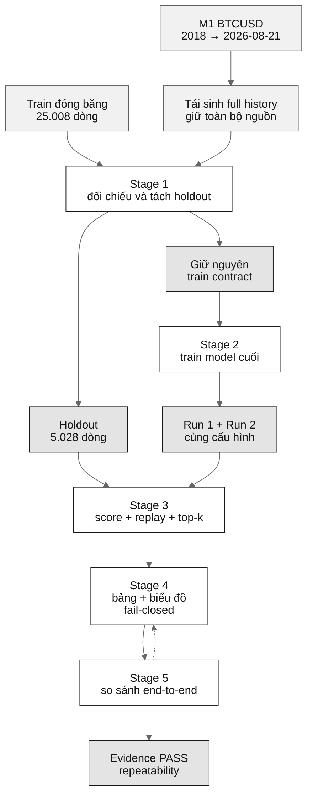
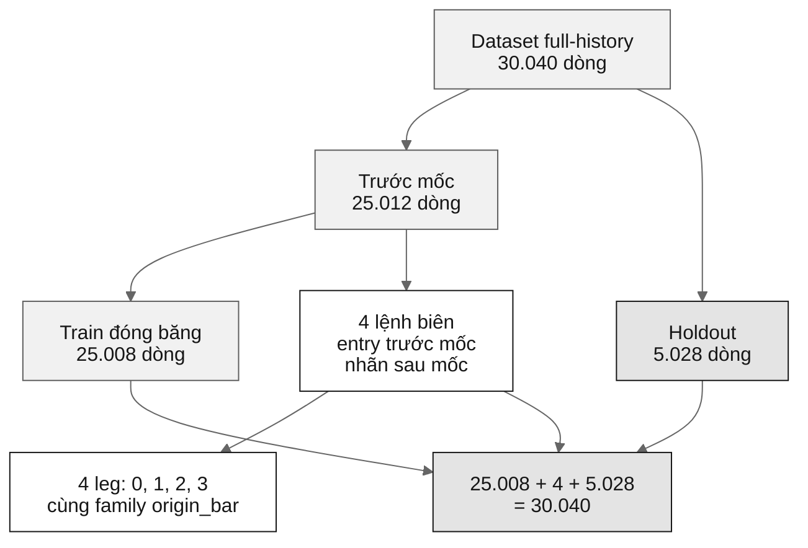
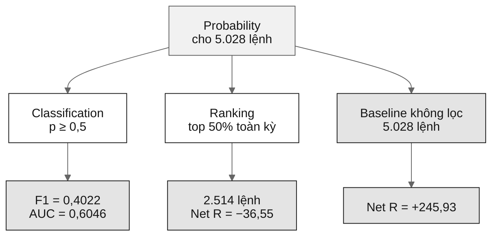

# Holdout Stage 1–5 — Nhóm 11

> Wireframe đọc hiểu quy trình kiểm định holdout của Pyramid BTCUSD / CatBoost.

**Điểm cần nhớ:** CatBoost là bộ lọc lệnh do `PyramidStrategy` tạo ra. PASS ở đây là bằng chứng reproducibility trong phạm vi đã ghi, không phải bằng chứng model sinh lợi nhuận.

> Mermaid trong Markdown không có toolbar zoom/fullscreen riêng. Các thao tác này phụ thuộc vào Markdown viewer: dùng zoom/fullscreen của trình duyệt hoặc tính năng của GitHub, VS Code, Obsidian, v.v. Các diagram bên dưới dùng **Mermaid Markdown Strings**, `markdownAutoWrap: true` và `wrappingWidth: 180`; không để node dài trên một dòng.

## 1. Flow tổng thể

Mỗi stage tạo artifact. Stage sau chỉ được xem là hợp lệ khi artifact và gate của stage trước đã được kiểm tra.



### Vì sao có mũi tên đứt?

Code hiện tại có quan hệ evidence gần vòng:

- Stage 4 cần Stage 5 `PASS` để vượt evidence gate.
- Stage 5 lại so artifact Stage 4 của run 1 và run 2.

Đây là quy trình đối chiếu artifact đã tồn tại, **không phải chuỗi bootstrap từ thư mục trống chỉ cần chạy 1 → 5**.

## 2. Số cần nhớ

| Hạng mục | Giá trị |
|---|---:|
| Mốc holdout | `2025-02-08 15:30:00` |
| Bar M15 của mốc | `199.968` |
| Train đóng băng | `25.008` dòng = `6.252` họ × `4` leg |
| Holdout | `5.028` dòng |
| Dataset full-history | `30.040` dòng |
| Feature / metadata | `23 / 7` |
| Purge + embargo ở bốn fold phát triển | `21 + 3 + 8 + 2 = 34` dòng |
| Purge + embargo ở final train | `0` dòng |
| Holdout ROC-AUC / F1 | `0,6046 / 0,4022` |
| Baseline holdout | `+245,93 R`, PF `1,0992` |
| Holdout top 50% | `−36,55 R`, PF `0,9718` |

## 3. Stage 1–5

| Stage | Input → thao tác | Gate / output | Ý nghĩa |
|---|---|---|---|
| **1** | M1 + train đóng băng → tái sinh full history, tách theo `entry_time` tại mốc thật | `25.012` dòng trước mốc; `25.008` khóa train; `575.184` ô feature khớp; xuất full dataset, holdout và JSON report | Đảm bảo tái sinh không làm thay đổi hợp đồng train cũ |
| **2** | Train `25.008` + `23` feature → kiểm tra purge/embargo, fit CatBoost run 1 và run 2 | Purge `= 0`; embargo `= 0`; `25.008` train prediction giống nhau; xuất model, prediction array và reproducibility JSON | Kiểm tra model cuối chạy lặp trên cùng máy/code/dataset/config |
| **3** | Model + holdout + M1 + reference → score, replay toàn lịch sử, join baseline, chọn top `20–80%` | Baseline `5.028/5.028` khớp reference; hash holdout không đổi; xuất probability, top-k, summary và report | Đo xếp hạng lệnh và tác động lọc, không train lại |
| **4** | Evidence Stage 1–3 + canonical OOF/backtest → tính lại metric, tạo bốn bảng, hai biểu đồ và báo cáo | Thiếu evidence thì không xuất báo cáo `PASS`; xuất `table1…table4`, HTML/PNG, manifest và Markdown report | Đóng gói số canonical chỉ khi mọi điều kiện đạt |
| **5** | Stage 3–4 run 1 và run 2 → so xác suất, AUC/F1, top-k, bảng và chart hash | Delta `= 0`; top-k trùng `100%`; bốn chart cùng SHA-256; xuất `stage5_repro_report.json` | Đo repeatability end-to-end, không phải lợi nhuận |

### Mục đích từng Stage

- **Stage 1 — Tái sinh và tách:** tạo được holdout mà không thay đổi train contract.
- **Stage 2 — Train model cuối:** kiểm tra model có chạy đúng contract và lặp ổn định không.
- **Stage 3 — Score và backtest:** replay đúng baseline, score đúng 5.028 lệnh và tính top-k.
- **Stage 4 — Tổng hợp report:** chỉ xuất số canonical khi evidence đầy đủ.
- **Stage 5 — Reproducibility:** so hai lượt đầu–cuối trên cùng môi trường.

## 4. Dataset split

```text
25.008 train đóng băng
+    4 lệnh biên
+ 5.028 holdout
=30.040 dataset full-history
```

Bốn lệnh biên có `entry_time` trước mốc nhưng chỉ hoàn tất nhãn khi đã có dữ liệu tương lai. Chúng:

- không vào holdout vì entry trước mốc;
- không được tự thêm vào train vì train cũ bị cắt nguồn khi chưa đủ tương lai để gán nhãn;
- là vùng riêng của quy trình tái sinh.



## 5. F1 khác top-k

Hai phép chọn lệnh sau dùng cùng một xác suất nhưng khác nhau:



**Kết luận:** AUC/F1 đánh giá khả năng xếp hạng hoặc phân loại nhãn; Net R đánh giá bộ lệnh được giữ. F1 tốt hơn không tự động đồng nghĩa top 50% có lợi nhuận.

## 6. Điều kiện kiểm tra và giới hạn

- **Pyramid là nguồn tín hiệu:** CatBoost chỉ nhận ứng viên, chấm xác suất và lọc giữ/loại.
- **Label khác lợi nhuận:** fixed barrier 50 M15 không replay dynamic trailing stop, target 33,7% hoặc Friday exit.
- **Top-k là offline:** xếp toàn bộ kỳ đánh giá; không phải threshold biết trước tại thời điểm live.
- **Holdout không còn single-use tuyệt đối:** đã có các lượt kiểm tra kỹ thuật, sweep và thread-count sensitivity.
- **Reproducibility có phạm vi:** Stage 2/5 PASS trong cùng máy, cùng code, cùng dataset và cùng config; không suy ra giống byte trên mọi máy.
- **Backtest chưa đầy đủ live:** không gồm phí, spread, slippage, capital constraint, drawdown mark-to-market hoặc state thay đổi sau khi loại lệnh.
- **Bốn split:** Random `0,8582`, Grouped `0,7454`, Walk-forward `0,5875`, Purged Walk-forward `0,5895` ROC-AUC trên khúc 2–5.
- **Thread count:** cấu hình canonical dùng `thread_count=1`; kết quả top-k có thể nhạy với cấu hình train.

## 7. Câu trả lời bảo vệ ngắn

> “Pyramid tạo lệnh ứng viên, CatBoost chấm điểm và lọc lệnh. Vì dữ liệu có family overlap và thứ tự thời gian, nhóm thử Random, Grouped, Walk-forward và Purged Walk-forward. Holdout đạt AUC 0,6046 và F1 0,4022, nhưng top 50% đạt −36,55 R so với baseline +245,93 R. Đồ án chủ yếu kiểm tra độ nhạy của phương pháp và khả năng tái lập, chưa chứng minh bộ lọc sinh lợi nhuận live.”

Nguồn: `docs/DEFENSE_PREP_NHOM11.md`, `docs/TECHNICAL_REPORT_NHOM11.md`, `docs/HOLDOUT_RUNBOOK_NHOM11.md`.

## 8. Nguồn truy ngược

- [Báo cáo kỹ thuật](TECHNICAL_REPORT_NHOM11.md)
- [Ghi chú bảo vệ](DEFENSE_PREP_NHOM11.md)
- [Runbook holdout](HOLDOUT_RUNBOOK_NHOM11.md)
- [Báo cáo kết quả holdout](BAO_CAO_KET_QUA_HOLDOUT.md)
- [Stage 1](../scripts/holdout_stage1_split.py)
- [Stage 2](../scripts/holdout_stage2_train.py)
- [Stage 3](../scripts/holdout_stage3_backtest.py)
- [Stage 4](../scripts/holdout_stage4_report.py)
- [Stage 5](../scripts/holdout_stage5_repro_check.py)
- [Evidence validator](../src/citd_ml/verification/holdout_evidence.py)
- [Stage 5 artifact](../outputs/holdout/repro/stage5_repro_report.json)
- [Holdout history](../outputs/verification/holdout_run_history.md)
